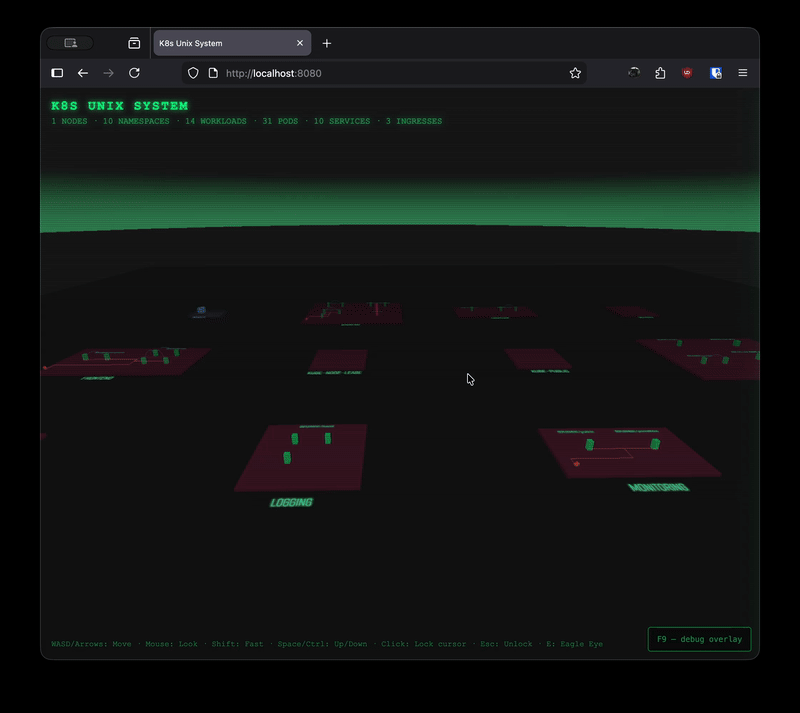

# 🦖 k8s Unix System

A 3D Kubernetes resource viewer inspired by the FSN (File System Navigator) from Jurassic Park. Fly through your cluster like it's 1993.

> "It's a Unix system! I know this!"

## Demo



<p align="center">
  
  
</p>

Namespaces are rendered as raised platforms (islands), pods as 3D blocks on each island. Live updates via Kubernetes watch API.

## Quick Start (Docker)

```bash
docker run --rm -it \
  -v ~/.kube/config:/root/.kube/config:ro \
  -p 8080:8080 \
  ghcr.io/jlandersen/k8s-unix-system:main

# Use a specific kubeconfig context
docker run --rm -it \
  -v ~/.kube/config:/root/.kube/config:ro \
  -p 8080:8080 \
  ghcr.io/jlandersen/k8s-unix-system:main --context my-cluster
```

Then open http://localhost:8080.

## Install

```bash
go install github.com/jeppe/k8s-unix-system/cmd@latest
```

Or build from source:

```bash
go build -o k8s-unix-system ./cmd/
```

## Usage

```bash
# Use current kubeconfig context
./k8s-unix-system

# Specify a context
./k8s-unix-system --context my-cluster

# Custom port, don't open browser
./k8s-unix-system --port 9090 --no-browser
```

Opens a browser with the 3D view. All data streams live from your cluster.

## Controls

| Key | Action |
|---|---|
| **Click** | Lock cursor for look-around |
| **WASD / Arrows** | Move |
| **Mouse** | Look around |
| **Space** | Fly up |
| **Ctrl** | Fly down |
| **Shift** | Move faster |
| **Hover pod / node** | Show details tooltip |
| **Esc** | Release cursor |

## Supported Resources

| Resource | How it's shown |
|---|---|
| **Pods** | 3D blocks on namespace platforms, colored by status, sized by CPU/memory requests |
| **Namespaces** | Raised platform islands that group all resources in the namespace |
| **Nodes** | Cubes on a dedicated dark-blue island, colored by Ready/NotReady status |
| **Workloads** | Pods grouped under their owning Deployment, StatefulSet, DaemonSet, Job, or CronJob |
| **Services** | Cyan arcs connecting pods that match the service's label selector |
| **Ingresses** | Orange diamond markers on the platform with orthogonal connector lines to target service pods |

All resources stream live from the cluster via the Kubernetes watch API.

## Visual Guide

### Pods
- **Green blocks** — Running pods
- **Yellow blocks** — Pending / Initializing
- **Red blocks** — Error / CrashLoopBackOff
- **Block height** — Increases with restart count
- Pods gently bob when running; error pods shake

### Nodes
Nodes are rendered on a separate dark-blue island labeled **NODES**. Each node is a cube colored by status:
- **Cyan blocks** — Ready
- **Red blocks** — NotReady

Hover a node to see its name, status, CPU capacity, and memory capacity.

### Services
Services are visualized as curved cyan arcs connecting pods that match a service's label selector. When a service selects two or more pods, arcs radiate from the first matched pod to the others, forming a star topology. Lines are semi-transparent so they don't obscure the rest of the scene.

### Ingresses
Ingresses appear as orange diamond markers on the front edge of namespace platforms. Orthogonal connector lines trace the path from each ingress to the pods backing its target services. Hover a marker to see the routing rules (host, path, backend service).

### Namespaces
- **Platform color** — Namespace island (pink/magenta)

## Flags

| Flag | Default | Description |
|---|---|---|
| `--context` | current | Kubernetes context |
| `--port` | 8080 | HTTP server port |
| `--no-browser` | false | Don't auto-open browser |
